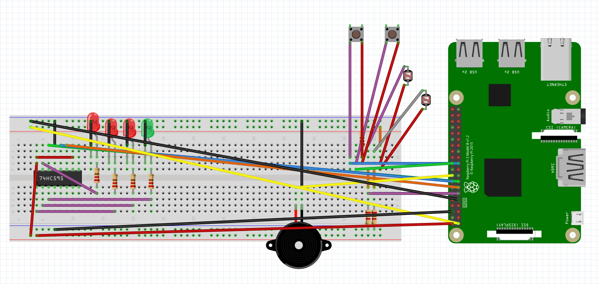
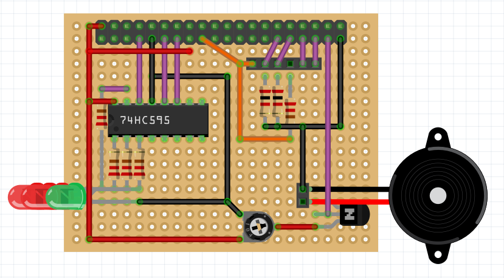
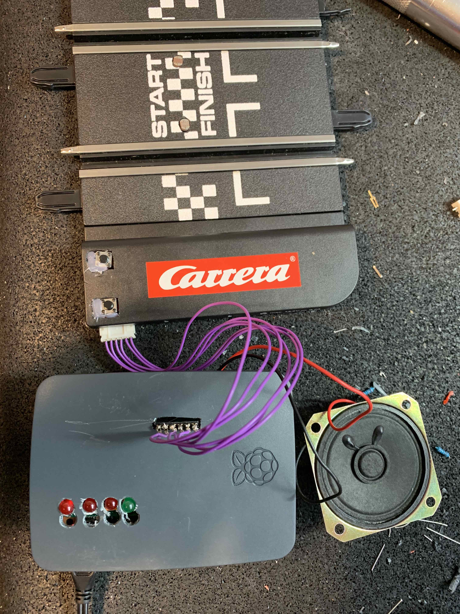
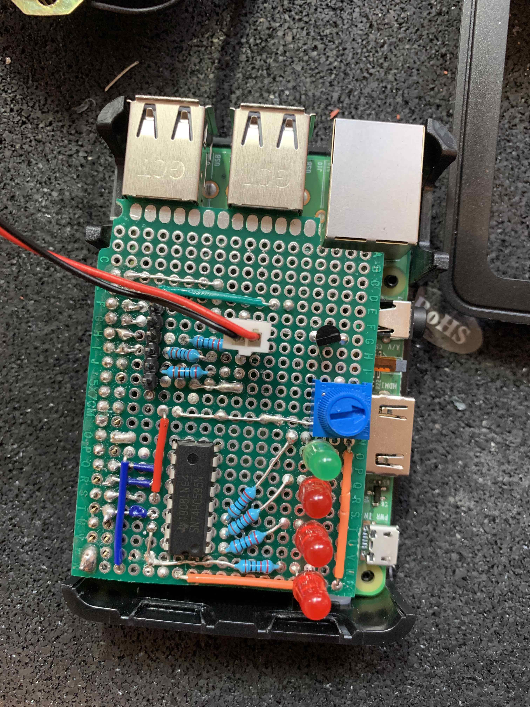
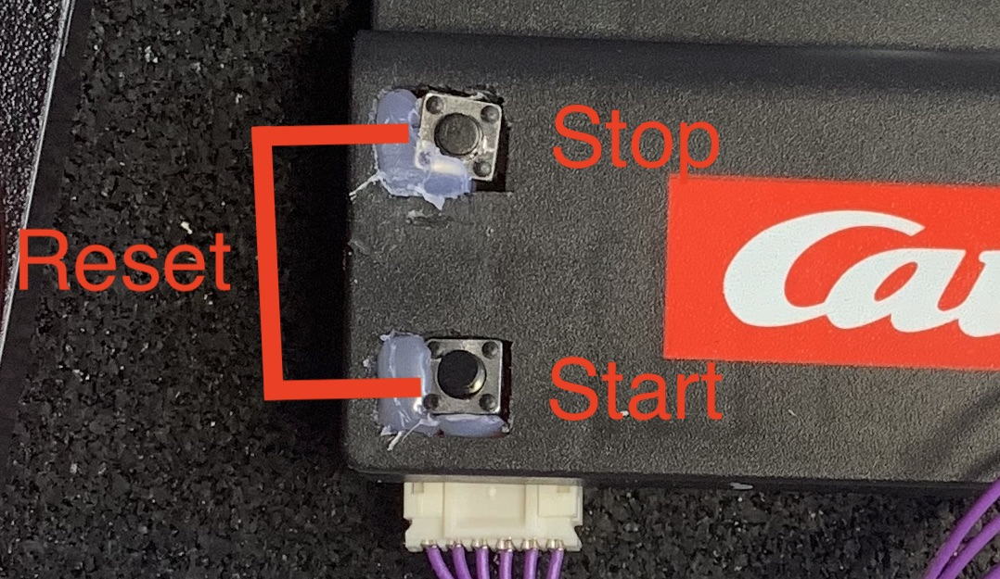

# Hacking a race track with Raspberry PI

## Parts

* An eletric race track. I used [Carrera- Supercharger](https://www.amazon.fr/Carrera-20062498-Carrera-Supercharger-Color%C3%A9/dp/B07PRBYDBF/ref=sr_1_fkmr0_1?__mk_fr_FR=%C3%85M%C3%85%C5%BD%C3%95%C3%91&crid=2S0ZHT9TBJ24D&keywords=carrera+go+supercharger&qid=1579268316&sprefix=carrera+go+supper%2Caps%2C142&sr=8-1-fkmr0) but you can use any race track you want. Just make sure the cars are large enough to place the sensors
* [ELEGOO electronic Kit](https://www.amazon.fr/gp/product/B01N0D3KTP/ref=ppx_yo_dt_b_asin_title_o06_s01?ie=UTF8&psc=1), it contains all the electronic components required
* A Raspberry Pi 3 or higher. I choose the official [Raspberry Pi 3 (16 Go) starter kit](https://www.amazon.fr/gp/product/B01CI5879A/ref=ppx_yo_dt_b_asin_title_o06_s00?ie=UTF8&psc=1)
* Basic electronic tools. I used soldering tin and electric cables salvaged from an old printer.

## The circuit

### Version 1
The initial version was made on the Breadboard included in the ELEGOO kit



For details have a look at the [Fritzing file](./extra/racing_car.fzz) 

### Version 2
To make it more robust, compact and transportable, you can build a hat for your Raspberry Pi that will fit in the Raspberry Pi case. You can also connect your buzzer to an NPN transistor and a potentiometer to control volume and make it louder.



Simply create holes in the case for the LEDs and connexion cable




For details have a look at the [Fritzing file](./extra/racing_car_hat.fzz)

## The Raspberry Pi

### setup

The Raspberry pi is running Raspbian. To conserve resources, I disabled the gui and ennabled ssh. You can follow [this guide](https://www.digikey.com/en/maker/blogs/2018/how-to-boot-to-command-line-and-ssh-on-raspberry-pi).

### Deploy

Copy the content of `./code/*` on the Raspberry and add exec mod to `start.sh`

```bash
sudo chmod +x start.sh
```

## Run

### Setup

1. Turn on the Raspberry Pi
2. Execute the `start.sh` script on the Raspberry Pi

### Start Racing

The physical buttons allow you to start a new race, stop a none finished race and reset a race. If the start button is pressed again, a new race is started.



